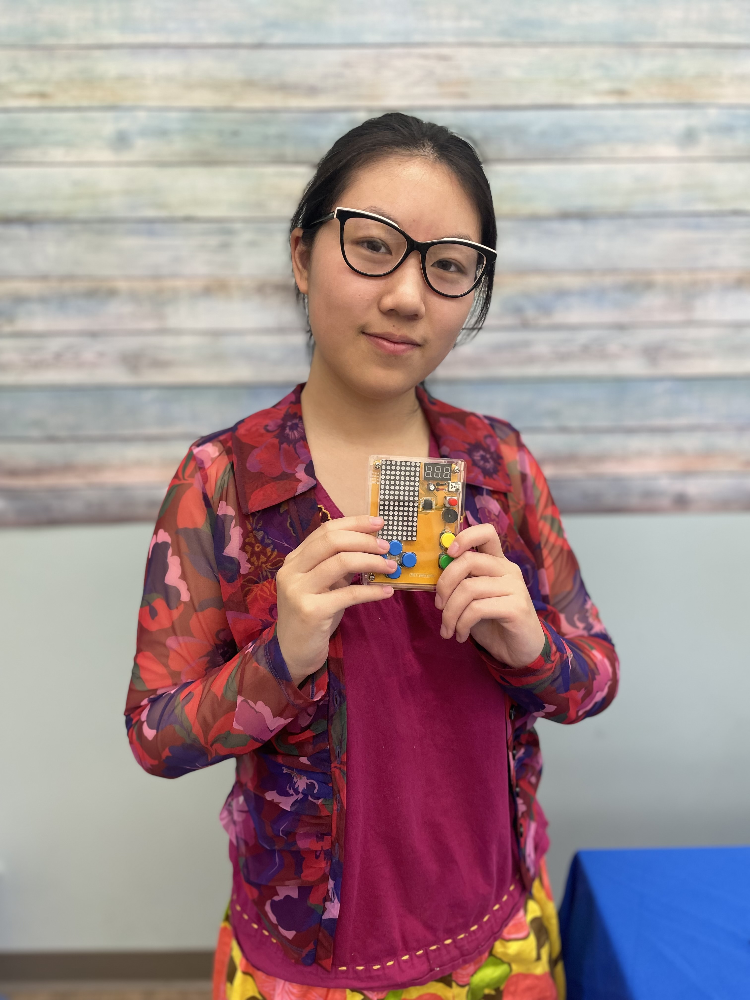
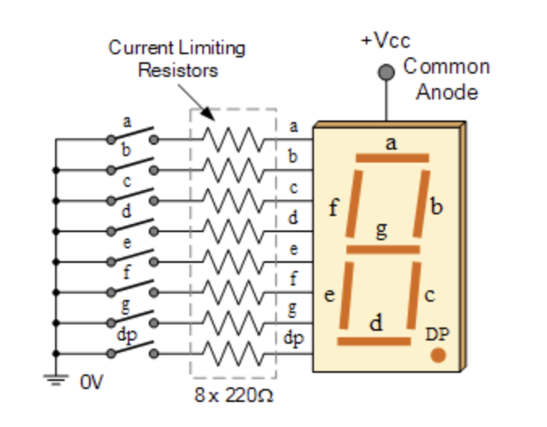

# Interactive Pet Planter
The interactive pet planter uses sensors to detect water levels in a planter. When a plant is watered, the planter will emit a sound alert once water levels reach a certain capacity. It also has an interactive display that changes as the water level increases.

| **Engineer** | **School** | **Area of Interest** | **Grade** |
|:--:|:--:|:--:|:--:|
| Teresa W | Palo Alto High School | Electrical Engineering | Incoming Junior



<!---**Replace the BlueStamp logo below with an image of yourself and your completed project. Follow the guide [here](https://tomcam.github.io/least-github-pages/adding-images-github-pages-site.html) if you need help.**

--->
  
<!---# Final Milestone--->

<!---**Don't forget to replace the text below with the embedding for your milestone video. Go to Youtube, click Share -> Embed, and copy and paste the code to replace what's below.**

<iframe width="560" height="315" src="https://www.youtube.com/embed/F7M7imOVGug" title="YouTube video player" frameborder="0" allow="accelerometer; autoplay; clipboard-write; encrypted-media; gyroscope; picture-in-picture; web-share" allowfullscreen></iframe>

For your final milestone, explain the outcome of your project. Key details to include are:
- What you've accomplished since your previous milestone
- What your biggest challenges and triumphs were at BSE
- A summary of key topics you learned about
- What you hope to learn in the future after everything you've learned at BSE--->


<!---# Second Milestone--->

<!---**Don't forget to replace the text below with the embedding for your milestone video. Go to Youtube, click Share -> Embed, and copy and paste the code to replace what's below.**

<iframe width="560" height="315" src="https://www.youtube.com/embed/y3VAmNlER5Y" title="YouTube video player" frameborder="0" allow="accelerometer; autoplay; clipboard-write; encrypted-media; gyroscope; picture-in-picture; web-share" allowfullscreen></iframe>

For your second milestone, explain what you've worked on since your previous milestone. You can highlight:
- Technical details of what you've accomplished and how they contribute to the final goal
- What has been surprising about the project so far
- Previous challenges you faced that you overcame
- What needs to be completed before your final milestone--->

# First Milestone

<!---**Don't forget to replace the text below with the embedding for your milestone video. Go to Youtube, click Share -> Embed, and copy and paste the code to replace what's below.**

<iframe width="560" height="315" src="https://www.youtube.com/embed/CaCazFBhYKs" title="YouTube video player" frameborder="0" allow="accelerometer; autoplay; clipboard-write; encrypted-media; gyroscope; picture-in-picture; web-share" allowfullscreen></iframe>

For your first milestone, describe what your project is and how you plan to build it. You can include:
- An explanation about the different components of your project and how they will all integrate together
- Technical progress you've made so far
- Challenges you're facing and solving in your future milestones
- What your plan is to complete your project--->

The planter consists of a shell, which makes up its form, and a planter in the middle for the plant itself. On the outside, there is a graphic user interface that displays data and graphics. This screen is called the Adafruit Pyportal Titano, which also contains all of the main processing components in the planter. On the inside of the planter is the STEMMA soil sensor, attached to the side with screws. All of the parts for the planter, excluding the screws, nuts, and electrical components, were 3D printed.

The two main components, the pyportal and the sensor, communicate with I2C protocol. I2C stands for inter-integrated circuit, because the pyportal and the sensor each have integrated circuits, which communicate with each other. An integrated circuit (IC) includes many small components like resistors and transitors, compressed into a small area in the form of a chip. In I2C communication, there is a master-slave dynamic where one device acts as the microcontroller with multiple peripherals. In this case, the pyportal acts as the master and the sensor acts as the slave. There are two wires involved in I2C protocol; SDA (serial data) and SCL (serial clock). Data is sent and recieved with the SDA, while the SCL carries the clock signal. The clock is essential to the data transmission process; since data is sent one bit at a time, it is imperative that the bits are sent in time.

(image placeholder)

As seen in this figure of the SDA and the SCL, there is a start and a stop condition required in the process. In the start condition, the SDA must go from high to low voltage before the SCL goes from high to low. For the stop condition, the SCL goes from low to high voltage before the SDA does.

Each slave possesses a 7 bit address. After sending the start condition, the master will send the address of the slave it wishes to communicate with, along with a read/write bit. This bit specifies whether data is being sent (low voltage) or recieved (high voltage). The slave sends back an ACK (ackknowledge) bit if the message was successfully recieved, and a NACK (no-acknowledge) bit if it was not recieved. From then on, data frames are sent in 8 bit packages, followed by an ACK or NACK bit, until the stop condition is achieved. 

(image placeholder)

This diagram illustrates the entire process of I2C protocol, from the start to the stop condition. In the case of the planter, the pyportal addresses the sensor and requests data from it. 

The sensor itself detects temperature in degrees celsius, and humidity from the value 200 (very dry) to 2000 (very wet). The pyportal processes the data taken and displays it on the graphic user interface. It contains a USB-C port for power and a microSD card slot for memory.

As of this milestone, the planter has been assembled, but it has yet to be connected to the internet. There were many times where the 3D printed parts had trouble fitting together due to the lack of precision in their construction. Additionally, the body of the planter had two holes which were meant for the USB charger and the microSD card. These holes were too small and needed to be enlarged via sanding down the sides with a dremel. 

In the next milestone, the pyportal will be connected to the internet and will be able to visualize data regarding the planter's internal humidity and temperature. This part of the process will involve coding with Circuitpython, a derivitive of python specialized for microcontrollers. 

<!---# Schematics--->
<!---Here's where you'll put images of your schematics. [Tinkercad](https://www.tinkercad.com/blog/official-guide-to-tinkercad-circuits) and [Fritzing](https://fritzing.org/learning/) are both great resoruces to create professional schematic diagrams, though BSE recommends Tinkercad becuase it can be done easily and for free in the browser.--->

<!---# Code--->
<!---Here's where you'll put your code. The syntax below places it into a block of code. Follow the guide [here]([url](https://www.markdownguide.org/extended-syntax/)) to learn how to customize it to your project needs. 

```c++
void setup() {
  // put your setup code here, to run once:
  Serial.begin(9600);
  Serial.println("Hello World!");
}

void loop() {
  // put your main code here, to run repeatedly:

}
```--->

<!---# Bill of Materials--->
<!---Here's where you'll list the parts in your project. To add more rows, just copy and paste the example rows below.
Don't forget to place the link of where to buy each component inside the quotation marks in the corresponding row after href =. Follow the guide [here]([url](https://www.markdownguide.org/extended-syntax/)) to learn how to customize this to your project needs. 

| **Part** | **Note** | **Price** | **Link** |
|:--:|:--:|:--:|:--:|
| Item Name | What the item is used for | $Price | <a href="https://www.amazon.com/Arduino-A000066-ARDUINO-UNO-R3/dp/B008GRTSV6/"> Link </a> |
| Item Name | What the item is used for | $Price | <a href="https://www.amazon.com/Arduino-A000066-ARDUINO-UNO-R3/dp/B008GRTSV6/"> Link </a> |
| Item Name | What the item is used for | $Price | <a href="https://www.amazon.com/Arduino-A000066-ARDUINO-UNO-R3/dp/B008GRTSV6/"> Link </a> |--->

# Starter Project: Retro Arcade Console

<iframe width="560" height="315" src="https://www.youtube.com/embed/QZQY198Sars?si=7Xs376vGNubwJR2j" title="YouTube video player" frameborder="0" allow="accelerometer; autoplay; clipboard-write; encrypted-media; gyroscope; picture-in-picture; web-share" referrerpolicy="strict-origin-when-cross-origin" allowfullscreen></iframe>

  The arcade console consists of a display, a scoreboard, multiple buttons, and a buzzer. In order to run, it requires either a micro usb or AAA batteries to transmit energy to the components. The base of the console is the PCB (printed circuit board); it contains the IC (integrated circuit) chip, which runs all functions on the board. It contains three parts: diodes, transitors, and microprocessors. The diodes control the flow of current in the circuit, while the transitors act as switches that allow voltage into the circuit at a specific capacity. The microprocessors perform calculations and carry out protocols. The IC chip is connected to the ground and vcc wires, and contains many input and output channels which extend to the different parts of the console. Depending on which inputs are activated, the chip will facilitate certain outputs, which changes the behavior of the device. 

  There are multiple games available on the arcade, including tetris, snake, race cars, space invaders, and a slot machine. The four blue buttons control the direction of objects on the LED display modules, which are made of many small lights. Together, the lights flash on and off to create patterns and images. The scoreboard, a seven segment display, works in a similar fashion; it can create any combination of digits by lighting up or turning off each segment. Here, a diagram of a seven segment display is shown below.


<br>Each segment is labelled with a letter from "a" to "g"; by turning on and off different segments, the display can show different digits.
  
  When booting up the device, the player can scroll through the different game options with the directional buttons. The green button is used to select a game or perform game-specific actions, such as rotating a shape or shooting objects. The yellow button pauses the game or exits from it. Every component of the console, aside from the case and the button caps, was soldered onto the PCB. The solder acts as an adhesive and allows the wire to conduct electricity to the rest of the board.

<!---# Other Resources/Examples--->
<!---One of the best parts about Github is that you can view how other people set up their own work. Here are some past BSE portfolios that are awesome examples. You can view how they set up their portfolio, and you can view their index.md files to understand how they implemented different portfolio components.
- [Example 1](https://trashytuber.github.io/YimingJiaBlueStamp/)
- [Example 2](https://sviatil0.github.io/Sviatoslav_BSE/)
- [Example 3](https://arneshkumar.github.io/arneshbluestamp/)

To watch the BSE tutorial on how to create a portfolio, click here.--->
