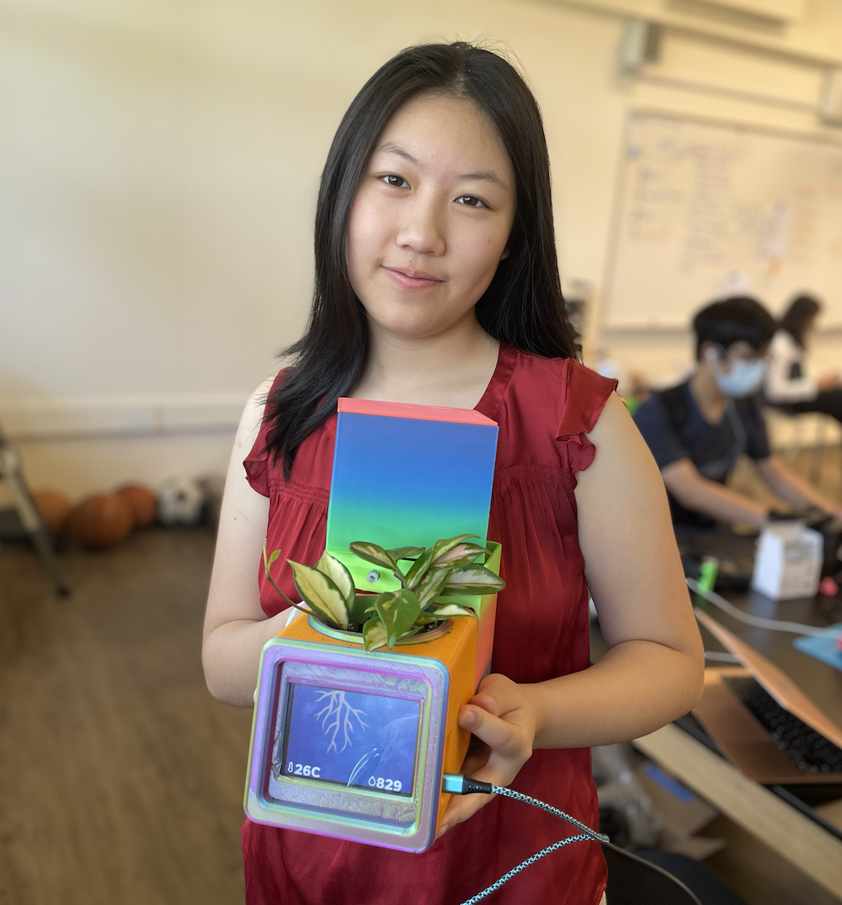
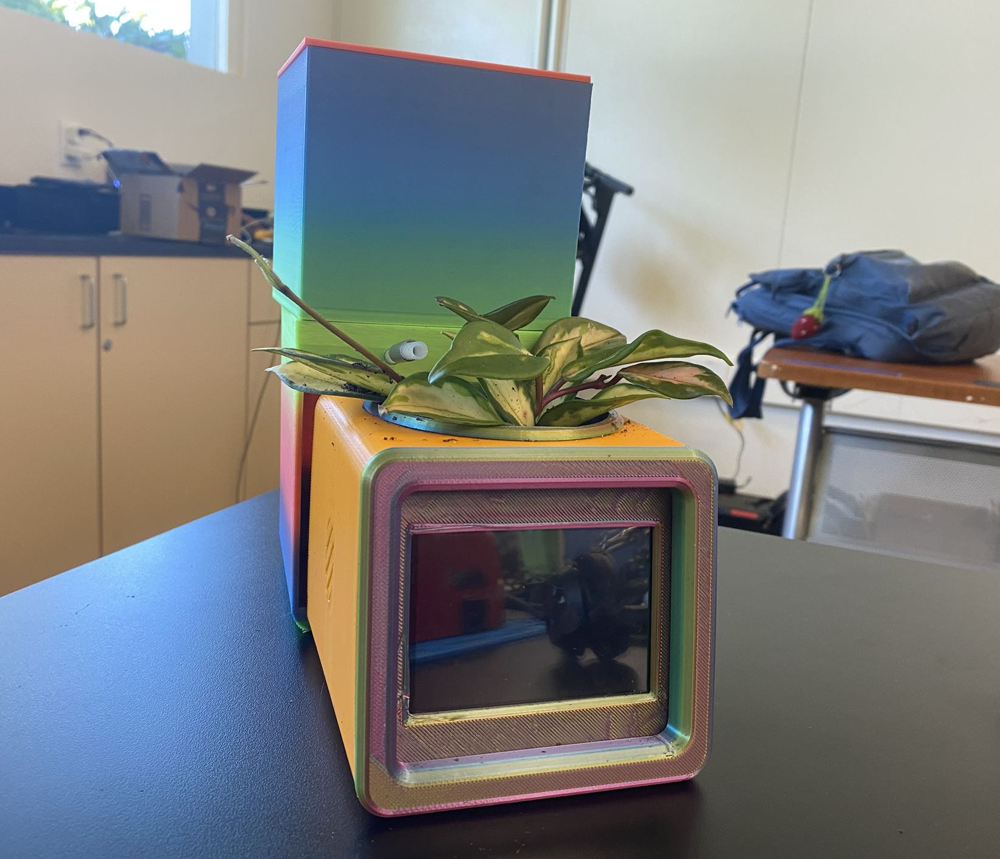
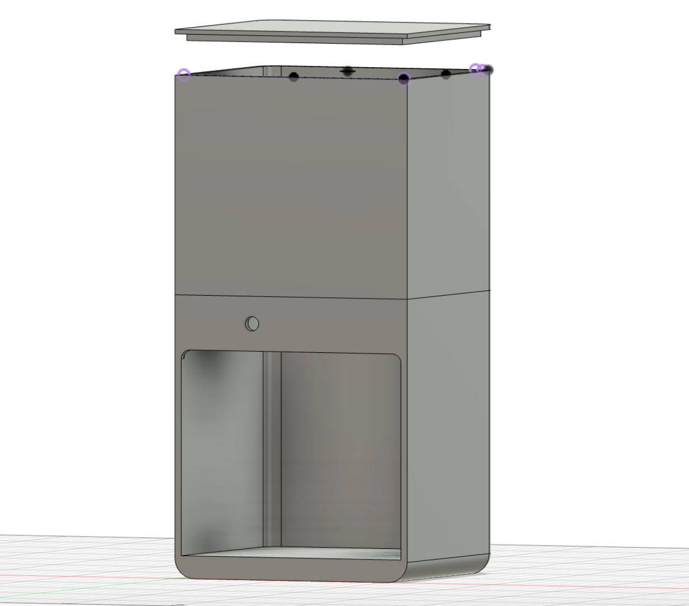
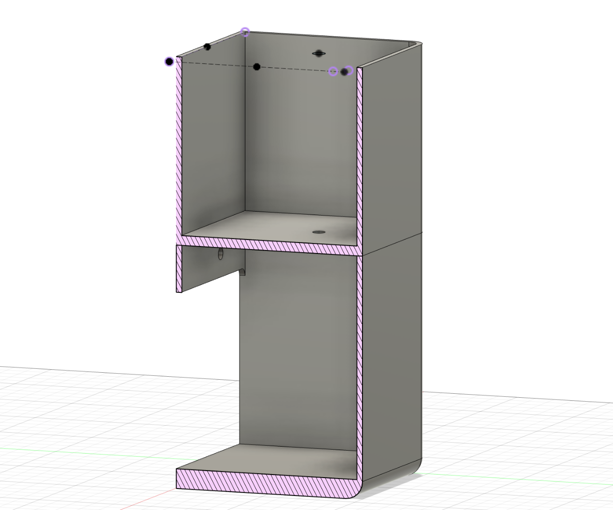
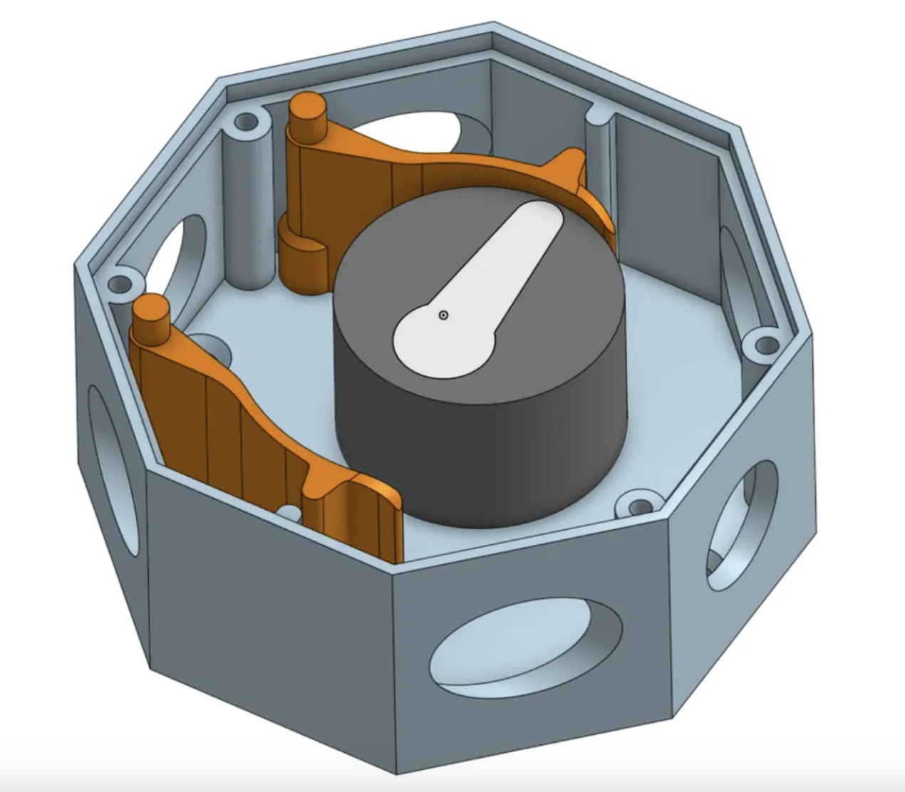
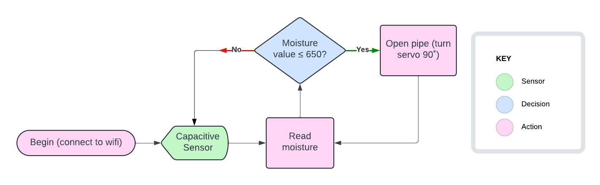
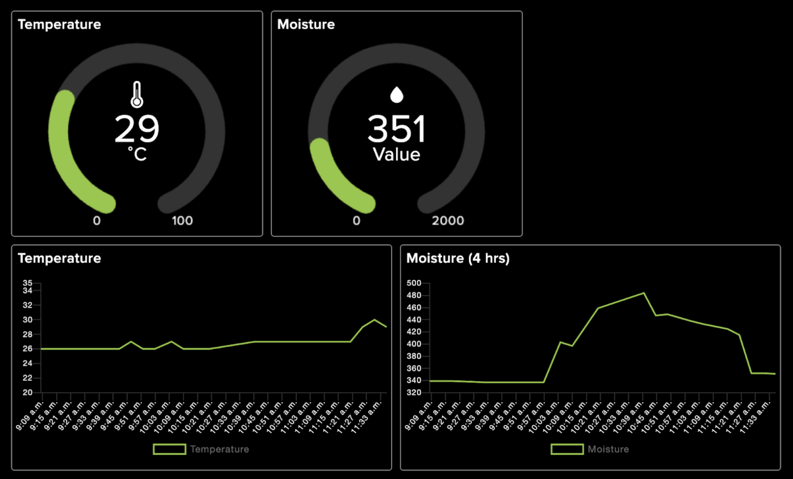

# Interactive Pet Planter
The interactive pet planter uses sensors to detect water levels in a planter. When a plant is watered, the planter will emit a sound alert once water levels reach a certain capacity. It also has an interactive display that changes as the water level increases.

| **Engineer** | **School** | **Area of Interest** | **Grade** |
|:--:|:--:|:--:|:--:|
| Teresa W | Palo Alto High School | Electrical Engineering | Incoming Junior

<!---->


<!---**Replace the BlueStamp logo below with an image of yourself and your completed project. Follow the guide [here](https://tomcam.github.io/least-github-pages/adding-images-github-pages-site.html) if you need help.**

--->
# Modification
<iframe width="560" height="315" src="https://www.youtube.com/embed/zJNkHwfHmJA?si=cW3HDYOQMQpxac4l" title="YouTube video player" frameborder="0" allow="accelerometer; autoplay; clipboard-write; encrypted-media; gyroscope; picture-in-picture; web-share" referrerpolicy="strict-origin-when-cross-origin" allowfullscreen></iframe>

My modification consists of adding an automatic water tank to the planter. When the moisture reaches critical levels, the tank will dispense water into the pot.


<br>**Figure 1:** The finished planter, complete with a lidded water tank. Only the top half contains water, while the other is a false bottom with empty space that houses the servo (motor system). The tank, the false bottom, and the lid are custom made 3D components, made in autodesk fusion360.



<br>**Figure 2a, 2b:** the 3D model of the water tank in fusion360. In the second image, it is cut open to reveal the cross section.

As seen in the images above, the bottom half contains a shelf 24 mm tall, which conceals the shell of the servo. There is also a ¼” hole in the water tank for the pipe to fit through. 


<br>**Figure 3:** Internal diagram of the servo’s 3D shell. The wheel in the middle is not centered and spins with an asymmetrical trajectory.
<br>Reference: [https://www.printables.com/en/model/207051-servo-valve](url)

In order to control the flow of water, the pipe is pinched shut by the servo until water is needed. The servo is attached to a 3D printed mechanism; when it moves, the wheel in the middle lifts aside one of the levers (orange). When a pipe is fitted through the holes in the side, the lever pinches it shut, preventing water from going through. 

To ensure the pipe will open and shut as needed, the servo is coded to open and close at certain times.


<br>**Figure 4:** The flowchart above visualizes how the servo is programmed. When the moisture level falls below the threshold of 650, the servo opens the pipe.

```CircuitPython
# library imports for servo
import time
import board
import pwmio
from adafruit_motor import servo

# create a PWMOut object on Pin D4.
pwm = pwmio.PWMOut(board.D4, duty_cycle=2 ** 15, frequency=50)

# Create a servo object, my_servo.
my_servo = servo.Servo(pwm)

my_servo.angle = 0
```
At the beginning of the code, the necessary libraries are imported and a PWMOut object is created. PWM, or Pulse Width Modulation, is responsible for making the servo run and alters how long the voltage is on compared to how long it isn’t on. Because the servo’s wires are connected to pin D4 of the PyPortal, the object is initialized with board.D4. The angle of the servo is set to 0 degrees, which closes the pipe and keeps the water from entering the planter.

```CircuitPython
if moisture <= SOIL_LEVEL_MIN: # also rotates servo to open when moisture below minimum
    print("Playing low water level warning...")
    pyportal.play_file(wav_water_low)
    for angle in range(0, 90, 5):  # 0 - 90 degrees, 5 degrees at a time.
        my_servo.angle = angle
    time.sleep(6)
```
When the moisture level falls below the minimum moisture level, the servo rotates 90 degrees and opens the pipe. It stays there for 4 seconds in order to allow ample water flow, then returns to 0 degrees, closing the pipe.

One of the challenges I faced while installing this modification was preventing the water tank from leaking. While the hole was perfectly sized for the pipe to fit through, it was not tight enough for water to stay inside the tank. I mitigated this by supergluing the outside edges of the pipe to the tank’s bottom wall. I also made the error of not closing the pipe at the beginning of the code, causing the pipe to continuously dispense water while the PyPortal loaded. Once that code was moved to the top, the issue disappeared.

The planter is now completely finished. Once the plant is added, it will be ready for demonstration.

# Final Milestone

<!---**Don't forget to replace the text below with the embedding for your milestone video. Go to Youtube, click Share -> Embed, and copy and paste the code to replace what's below.**-->

<iframe width="560" height="315" src="https://www.youtube.com/embed/j_EAJ4EFDQQ?si=lJ-RkzUypBsJbEJ5" title="YouTube video player" frameborder="0" allow="accelerometer; autoplay; clipboard-write; encrypted-media; gyroscope; picture-in-picture; web-share" referrerpolicy="strict-origin-when-cross-origin" allowfullscreen></iframe>

<!--For your final milestone, explain the outcome of your project. Key details to include are:
- What you've accomplished since your previous milestone
- What your biggest challenges and triumphs were at BSE
- A summary of key topics you learned about
- What you hope to learn in the future after everything you've learned at BSE--->

For my final milestone, I connected the planter to Wi-Fi so that it can display temperature and moisture data on the computer’s data interface. After a few minutes, the moisture and temperature values display on gauges and a line graph.


<br>**Figure 5:** The Adafruit IO dashboard. Temperature and moisture are shown as gauges and as data points on their respective line graphs.

In order for the data to display on Adafruit IO, information must be transmitted with Wi-Fi. In order to achieve this, I added another section of code in CircuitPython to set up the connection.

```CircuitPython
# SPDX-FileCopyrightText: 2019 ladyada for Adafruit Industries
# SPDX-License-Identifier: MIT

from os import getenv
import board
import busio
from digitalio import DigitalInOut
import adafruit_connection_manager
import adafruit_requests
from adafruit_esp32spi import adafruit_esp32spi

# Get wifi details and more from a settings.toml file
# tokens used by this Demo: CIRCUITPY_WIFI_SSID, CIRCUITPY_WIFI_PASSWORD
secrets = {
    "ssid": getenv("CIRCUITPY_WIFI_SSID"),
    "password": getenv("CIRCUITPY_WIFI_PASSWORD"),
}
if secrets == {"ssid": None, "password": None}:
    try:
        # Fallback on secrets.py until depreciation is over and option is removed
        from secrets import secrets
    except ImportError:
        print("WiFi secrets are kept in settings.toml, please add them there!")
        raise

print("ESP32 SPI webclient test")
```
The “secrets” dictionary gets the SSID (name) of the Wi-Fi network and its password from settings.toml, another file in the CIRCUITPY drive. If there is nothing there, the code will attempt to import from secrets.py; if that still does not work, a message will be printed to the pyportal reminding the user to add the Wi-Fi information. 

```CircuitPython
# If you are using a board with pre-defined ESP32 Pins:
esp32_cs = DigitalInOut(board.ESP_CS)
esp32_ready = DigitalInOut(board.ESP_BUSY)
esp32_reset = DigitalInOut(board.ESP_RESET)
```
The code above sets up the pins necessary for SPI (Serial Peripheral Interface) communication protocol. SPI communication is similar to I2C protocol in many ways. It relies on a controller-peripheral architecture; in this case, the PyPortal acts as the controller and the ESP32, which provides Wi-Fi connection, acts as the peripheral. Since the data transmits on one wire, the SCK (serial clock) is needed to synchronize the transfer of bits. Unlike I2C, there are two cables for communication; one from the controller to the peripheral, and one from the peripheral to the controller. There are also no addresses or start/stop conditions. The three lines in the image above initialize objects for digital input and output, with different pins for different aspects of SPI protocol. “board.ESP_CS” represents the pin for CS (chip select), which selects the peripheral in SPI protocol. “ESP_BUSY” checks if the ESP32 module is ready to accept new commands, and “ESP_RESET” resets it.

```CircuitPython
for ap in esp.scan_networks():
    print("\t%-23s RSSI: %d" % (ap["ssid"], ap["rssi"]))

print("Connecting to AP...")
while not esp.is_connected:
    try:
        esp.connect_AP(secrets["ssid"], secrets["password"])
    except OSError as e:
        print("could not connect to AP, retrying: ", e)
        continue
```

The for loop above searches for nearby Wi-Fi networks and prints their SSID (name) and RSSI (signal strength). Inside the while loop, the ESP32 module continuously attempts to connect to Wi-Fi with the SSID and password stored inside the “secrets” dictionary. If the connection is not established, it will continue to try until the Wi-Fi is connected. 

```CircuitPython
TEXT_URL = "http://wifitest.adafruit.com/testwifi/index.html"
JSON_URL = "http://api.coindesk.com/v1/bpi/currentprice/USD.json"

# esp._debug = True
print("Fetching text from", TEXT_URL)
r = requests.get(TEXT_URL)
print("-" * 40)
print(r.text)
print("-" * 40)
r.close()

print()
print("Fetching json from", JSON_URL)
r = requests.get(JSON_URL)
print("-" * 40)
print(r.json())
print("-" * 40)
r.close()

print("Done!")
```
TEXT_URL and JSON_URL test the Wi-Fi connection in two ways. The text url tests the transfer of text, while the json url tests the transfer of data. The request in the code above is an HTTP (HyperText Transfer Protocol) request; the client sends an HTTP request to the server and the server sends back a response after processing.

# Conclusion
At Bluestamp Engineering, I faced many challenges. Of those challenges, there were three that were the most difficult to overcome. The first was construction issues; there were often times where the 3D printed assets did not come together properly. For example, the holes for the USB-C cable and SD card had to be enlarged with a dremel. The second was the PyPortal; it had problems running because the files in the library were not up to date, and I needed to be creative and source files from elsewhere to start it up. And finally, the code was completely foreign to me and required ample research to understand. What helped the most was reading the documentation to figure out how the code worked and debug errors.

Yet there were also many triumphs. After each milestone, I had a functioning product that either looked coherent or could display data of some sort. One of my greatest triumphs was when I successfully displayed data onto the PyPortal; it required not only setting up the planter itself, but also debugging faulty code and spending time understanding it. 

I learned many key concepts while building my project. For example, I learned how devices communicate between each other with serial communication protocols such as I2C or SPI. I also learned how capacitive sensors detect levels of moisture. While working on my modification, attaching an automatic water tank, I learned how to create 3D models on autodesk fusion360. In the future, I hope to dive deeper into product design and create more functional products.

# Second Milestone

<!---**Don't forget to replace the text below with the embedding for your milestone video. Go to Youtube, click Share -> Embed, and copy and paste the code to replace what's below.**--->

<iframe width="560" height="315" src="https://www.youtube.com/embed/-ou_l0WgVIU?si=ANYcrzvfIYj-Dlh3" title="YouTube video player" frameborder="0" allow="accelerometer; autoplay; clipboard-write; encrypted-media; gyroscope; picture-in-picture; web-share" referrerpolicy="strict-origin-when-cross-origin" allowfullscreen></iframe>

<!---For your second milestone, explain what you've worked on since your previous milestone. You can highlight:
- Technical details of what you've accomplished and how they contribute to the final goal
- What has been surprising about the project so far
- Previous challenges you faced that you overcame
- What needs to be completed before your final milestone--->

For my second milestone, I first connected the moisture detection sensor to the main processing component,then connected the processing component to the computer, and finally displayed the moisture level inside the planter on the screen. Now, when water makes contact with the sensor, the screen will be filled with water. There is also a minimum and maximum moisture level; if those limits are surpassed, an audio warning will be played. 

<!----->

<!---->

<!----->

<br>**Figure 6a, 6b, 6c:** The photos above show the screen when there is no moisture, partial moisture, and full moisture in succession. As the moisture level detected by the sensor increases, the screen is filled with water to show the user how much water to pour. On the bottom left, the temperature is shown in Celsius and on the bottom right, the moisture value is shown.

The soil sensor measures from a spectrum of 650 to 800 units of moisture. The sensor is capacitive, meaning it does not make contact with any substance directly; rather, it emits an electrical field and anything that disrupts that field registers as a separate substance. The PyPortal is, in turn, powered by the computer by a USB C cable. As stated from the previous milestone, the PyPortal and sensor communicate through I2C protocol. 


<br>**Figure 7:** This diagram illustrates how a capacitive sensor works. A dielectric medium (material that does not conduct electricity) is surrounded by two conductive plates. When water comes into contact with the sensor, the capacitance, or ability to store charge, of the medium increases. The change in capacitance allows the sensor to detect levels of moisture.
<br>Reference: [https://www.realpars.com/blog/capacitive-sensor#:~:text=A%20capacitive%20sensor%20is%20an,detected%20by%20a%20capacitive%20sensor.](url)

The PyPortal runs on CircuitPython, an offshoot of Python. It contains the CIRCUITPY drive, which possesses the “lib” folder. The lib folder contains a library of all essential files for different components of the planter, including software and assets for the sounds, images, and other files. These assets are imported onto code.py, where the main commands are executed. Most of the functions on code.py are for setting up the graphics and I2C communications. When water makes contact with the sensor, the screen fills with blue to represent water being poured into the planter, and the moisture level increases. The function fill_water is responsible for this animation; it takes fill_percent as input, the percentage of the display which is filled with blue pixels. When fill_val, the fill value, exceeds fill_percent, the blue pixels recede and cause the water to go down. The opposite is also true; when fill_val is less than fill_percent, the blue pixels go up on the screen. The function display_temperature allows the user to switch between displaying Celsius or Fahrenheit. If is_celsius is set to True, the screen will display the temperature in Celsius, and vice versa if is_celsius is set to False. 

The second milestone was surprisingly difficult to complete. One challenge of setting up the PyPortal was debugging the errors. In the beginning of the process, there was one error that kept popping up where the .mpy files were said to be outdated. I attempted to remedy this by importing py versions of the files into the lib folder, but this ultimately turned out to be unnecessary and caused more errors. After switching between PyPortals in an effort to fix the issue, I added the original lib folder assets to the original PyPortal and added the other assets from another folder.

There is an ongoing issue with the PyPortal having issues connecting to the computer. In the future, this problem needs to be fixed in order to allow data to be displayed online. By the third milestone, it will be possible to access temperature and moisture data from Adafruit’s IO dashboard.

# First Milestone

<!---**Don't forget to replace the text below with the embedding for your milestone video. Go to Youtube, click Share -> Embed, and copy and paste the code to replace what's below.**--->

<iframe width="560" height="315" src="https://www.youtube.com/embed/iO0iW5_YAmA?si=KOmS30yCWdqFisZ2" title="YouTube video player" frameborder="0" allow="accelerometer; autoplay; clipboard-write; encrypted-media; gyroscope; picture-in-picture; web-share" referrerpolicy="strict-origin-when-cross-origin" allowfullscreen></iframe>

<!---For your first milestone, describe what your project is and how you plan to build it. You can include:
- An explanation about the different components of your project and how they will all integrate together
- Technical progress you've made so far
- Challenges you're facing and solving in your future milestones
- What your plan is to complete your project--->

My first milestone was assembling the body of my IoT (Internet of Things) planter. Internet of things is the idea of connecting ordinary electronic devices together to create a network.

The planter consists of a shell, which makes up its form, and a planter in the middle for the plant itself. On the outside, there is a graphic user interface that displays data and graphics. This screen is called the Adafruit PyPortal Titano, which also contains all of the main processing components in the planter. On the inside of the planter is the STEMMA soil sensor, attached to the side with screws. All of the parts for the planter, excluding the screws, nuts, and electrical components, were 3D printed.

<!----->

<!---->

<br>**Figure 8a, 8b:** The unassembled parts and the assembled result. The body of the planter is orange because it was warped in printing and had to be replaced. 
<br>Reference: [https://learn.adafruit.com/pyportal-pet-planter-with-adafruit-io/3d-printing](url) 

The two main components, the PyPortal and the multimodal (multiple modes) sensor, communicate with I2C protocol. I2C stands for inter-integrated circuit, the method by which PyPortal and the sensor communicate with each other through two wires.  An integrated circuit (IC) includes many small components like resistors and transistors, compressed into a small area in the form of a chip. In I2C communication, there is a controller-peripheral dynamic where one device acts as the microcontroller with multiple peripherals. In this case, the PyPortal acts as the controller and the sensor acts as the peripheral. There are two wires involved in I2C protocol; SDA (serial data) and SCL (serial clock). Data is sent and received with the SDA, while the SCL carries the clock signal. The clock is essential to the data transmission process; since data is sent one bit at a time, it is imperative that the bits are sent in time.


<br>**Figure 9:** As seen in this figure of the SDA and the SCL, there is a start and a stop condition required in the process. In the start condition, the SDA must go from high to low voltage before the SCL goes from high to low. For the stop condition, the SCL goes from low to high voltage before the SDA does.
<br> Reference: https://www.researchgate.net/figure/I2C-protocol-data-transmission-timing-diagram_fig3_339803306 

Each peripheral possesses a 7 bit address. After sending the start condition, the controller will send the address of the peripheral it wishes to communicate with, along with a read/write bit. This bit specifies whether data is being sent (low voltage) or received (high voltage). The peripheral sends back an ACK (acknowledge) bit if the message was successfully received, and a NACK (no-acknowledge) bit if it was not received. From then on, data frames are sent in 8 bit packages, followed by an ACK or NACK bit, until the stop condition is achieved. 


<br>**Figure 10:** This diagram illustrates the entire process of I2C protocol, from the start to the stop condition. In the case of the planter, the PyPortal addresses the sensor and requests data from it.
<br>Reference: [https://www.circuitbasics.com/basics-of-the-i2c-communication-protocol/](url) 

The sensor itself detects temperature in degrees celsius, and humidity from the value 200 (very dry) to 2000 (very wet). The PyPortal processes the data taken and displays it on the graphic user interface. It contains a USB-C port for power and a microSD card slot for memory.

The nature of the milestone is mostly mechanical. As of this milestone, the planter has been assembled, but it has yet to be connected to the internet. There were many times where the 3D printed parts had trouble fitting together due to the lack of precision in their construction. Additionally, the body of the planter had two holes which were meant for the USB charger and the microSD card. These holes were too small and needed to be enlarged via sanding down the sides with a dremel. 

In the next milestone, the PyPortal will be connected to the internet and will be able to visualize data regarding the planter's internal humidity and temperature. This part of the process will involve coding with CircuitPython, a derivative of Python specialized for microcontrollers. 

<!---# Schematics--->
<!---Here's where you'll put images of your schematics. [Tinkercad](https://www.tinkercad.com/blog/official-guide-to-tinkercad-circuits) and [Fritzing](https://fritzing.org/learning/) are both great resoruces to create professional schematic diagrams, though BSE recommends Tinkercad becuase it can be done easily and for free in the browser.--->

<!---# Code--->
<!--Here's where you'll put your code. The syntax below places it into a block of code. Follow the guide [here]([url](https://www.markdownguide.org/extended-syntax/)) to learn how to customize it to your project needs.-->

<!--```c++
void setup() {
  // put your setup code here, to run once:
  Serial.begin(9600);
  Serial.println("Hello World!");
}

void loop() {
  // put your main code here, to run repeatedly:

}
```-->

# Bill of Materials
<!---Here's where you'll list the parts in your project. To add more rows, just copy and paste the example rows below.
Don't forget to place the link of where to buy each component inside the quotation marks in the corresponding row after href =. Follow the guide [here]([url](https://www.markdownguide.org/extended-syntax/)) to learn how to customize this to your project needs.-->

| **Part** | **Note** | **Price** | **Link** |
|:--:|:--:|:--:|:--:|
| 3D printed parts (3D filament) | Body of the planter, body of the tank, body of the servo. Tank was self made | N/A | <a href="https://learn.adafruit.com/pyportal-pet-planter-with-adafruit-io/3d-printing"> Link </a> |
| M3 hardware (screws) | Attaches Pyportal to front of planter| N/A | N/A |
| Adafruit PyPortal Titano | Main processor, screen of planter | $59.95 | <a href="https://www.adafruit.com/product/4444"> Link </a> |
| Adafruit STEMMA Soil Sensor - I2C Capacitive Moisture Sensor - JST PH 2mm | Detects ambient moisture and temperature | $7.50 | <a href="https://www.adafruit.com/product/4026"> Link </a> |
| Black Nylon Machine Screw and Stand-off Set – M2.5 Thread | Screws and nuts used to attach sensor to the planter | $16.95 | <a href="https://www.adafruit.com/product/3299"> Link </a> |
| STEMMA Cable - 4 Pin JST-PH 2mm Cable–Female/Female - 150mm/6" Long | Connects PyPortal to the sensor | $0.75 | <a href="https://www.adafruit.com/product/3568"> Link </a> |
| Mini Oval Speaker - 8 Ohm 1 Watt | Amplifies audio | $1.95 | <a href="https://www.adafruit.com/product/3923"> Link </a> |
| USB Type A to Type C Cable - approx 1 meter / 3 ft long | Provides power to the PyPortal | $4.95 | <a href="https://www.adafruit.com/product/4474"> Link </a> |
| 5V 1A (1000mA) USB port power supply - UL Listed | Connect the wire to a power port | $5.95 | <a href="https://www.adafruit.com/product/501"> Link </a> |
| Generic micro servo | Connect the wire to a power port | $2.10 | <a href="https://www.smraza.com/products/smraza-10-pcs-sg90-9g-micro-servo-motor-kit-for-rc-robot-arm-helicopter-airplane-car-boat-control-arduino-project-s51"> Link </a> |
| 3 pin JST connector | Connect the servo to the PyPortal | N/A | N/A |
| 1/4 inch pipe | Carry water from tank to planter | $8.85 | <a href="https://www.amazon.com/Flexible-Lightweight-Non-Toxic-Multipurpose-Reinforced/dp/B0B13Z7M55/ref=asc_df_B0B13Z7M55/?tag=hyprod-20&linkCode=df0&hvadid=692875362841&hvpos=&hvnetw=g&hvrand=71831162362843556&hvpone=&hvptwo=&hvqmt=&hvdev=c&hvdvcmdl=&hvlocint=&hvlocphy=9032183&hvtargid=pla-2281435179058&mcid=6c434c6faf423f7eb1bc860de828417b&hvocijid=71831162362843556-B0B13Z7M55-&hvexpln=73&gad_source=1&th=1"> Link </a> |

# Starter Project: Retro Arcade Console

<iframe width="560" height="315" src="https://www.youtube.com/embed/QZQY198Sars?si=7Xs376vGNubwJR2j" title="YouTube video player" frameborder="0" allow="accelerometer; autoplay; clipboard-write; encrypted-media; gyroscope; picture-in-picture; web-share" referrerpolicy="strict-origin-when-cross-origin" allowfullscreen></iframe>

  The arcade console consists of a display, a scoreboard, multiple buttons, and a buzzer. In order to run, it requires either a micro usb or AAA batteries to transmit energy to the components. The base of the console is the PCB (printed circuit board); it contains the IC (integrated circuit) chip, which runs all functions on the board. It contains three parts: diodes, transitors, and microprocessors. The diodes control the flow of current in the circuit, while the transitors act as switches that allow voltage into the circuit at a specific capacity. The microprocessors perform calculations and carry out protocols. The IC chip is connected to the ground and vcc wires, and contains many input and output channels which extend to the different parts of the console. Depending on which inputs are activated, the chip will facilitate certain outputs, which changes the behavior of the device. 

  There are multiple games available on the arcade, including tetris, snake, race cars, space invaders, and a slot machine. The four blue buttons control the direction of objects on the LED display modules, which are made of many small lights. Together, the lights flash on and off to create patterns and images. The scoreboard, a seven segment display, works in a similar fashion; it can create any combination of digits by lighting up or turning off each segment. Here, a diagram of a seven segment display is shown below.


<br>**Figure 11:** Each segment is labelled with a letter from "a" to "g"; by turning on and off different segments, the display can show different digits.
  
  When booting up the device, the player can scroll through the different game options with the directional buttons. The green button is used to select a game or perform game-specific actions, such as rotating a shape or shooting objects. The yellow button pauses the game or exits from it. Every component of the console, aside from the case and the button caps, was soldered onto the PCB. The solder acts as an adhesive and allows the wire to conduct electricity to the rest of the board.

<!---# Other Resources/Examples--->
<!---One of the best parts about Github is that you can view how other people set up their own work. Here are some past BSE portfolios that are awesome examples. You can view how they set up their portfolio, and you can view their index.md files to understand how they implemented different portfolio components.
- [Example 1](https://trashytuber.github.io/YimingJiaBlueStamp/)
- [Example 2](https://sviatil0.github.io/Sviatoslav_BSE/)
- [Example 3](https://arneshkumar.github.io/arneshbluestamp/)

To watch the BSE tutorial on how to create a portfolio, click here.--->
